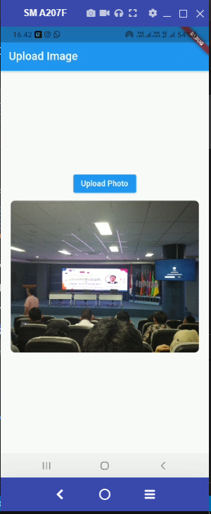

# Local Storage dan Video Player di Flutter

## Upload File

## 1. Melakukan import image_picker pada pubspec.yaml

## 2. Menjalankan aplikasi tampil button upload image

## 3. Ketika klik upload image akan muncul memilih media dari galeri atau mengambil langsung dari camera 

## 4. Menampilkan hasil dari mengambil foto di media 

## Video Player Plugin

## 1. Melakukan import video_player pada pubspec.yaml

## 2. Menjalankan aplikasi tampil butterfly video dengan terdapat button play dan pause

